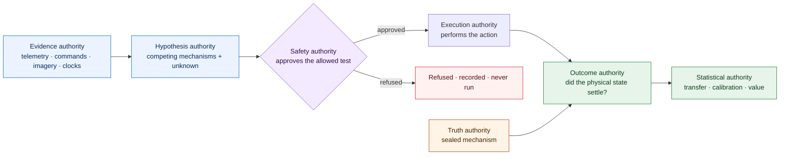
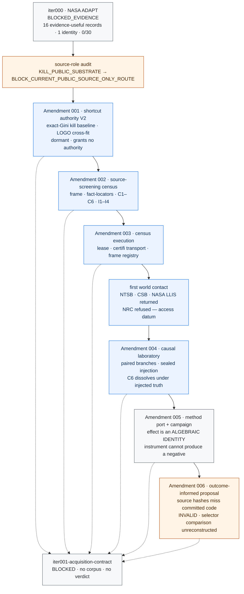
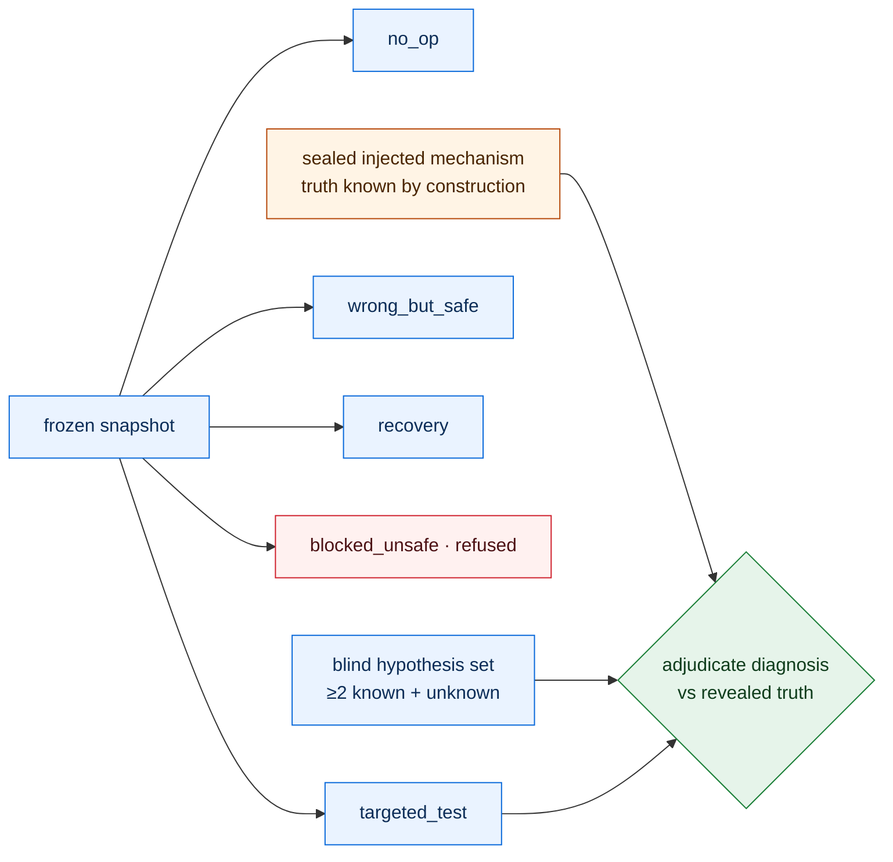

# Inbar

**A research program for physical causal evidence: testing whether an open-world multimodal
system can identify the physical mechanism behind an incident from incomplete evidence, choose a
safe test that discriminates competing explanations, recover under independently-governed
execution, and stay calibrated on hardware it has never seen — with the authority to *propose* a
mechanism held permanently separate from the authority to establish truth, to act, and to
adjudicate the outcome.**

> **Honest status up front. Scientific state: `bootstrap`, BLOCKED at `iter001-acquisition-contract`.**
> No corpus is admitted, no incident is screened to a verdict, no claim-bearing simulation campaign
> has run under a compute lease, and **no physical result exists**. Historical simulator documents
> exist, but the current claim registry activates none of them as a scientific result. Iteration 000
> returned `BLOCKED_EVIDENCE` on NASA ADAPT: 16
> evidence-useful experiment records on 1 hardware identity, 0 of a required 30 complete dossiers.
> They are not called incidents here, because the incident construct is exactly what that gate
> denied them. The public-source route is
> recorded as `BLOCK_CURRENT_PUBLIC_SOURCE_ONLY_ROUTE` — a dated, non-systematic reconnaissance,
> not an established negative. Six owner-signature receipts exist, but A006 does **not** cover the
> committed graded laboratory or active selector: the source hashes it binds match neither the first
> committed nor the current implementation. Under a real owner-signed lease, the census executor
> made first live contact
> with public investigation sources — NTSB, the Chemical Safety Board, and NASA LLIS returned bytes
> to an honestly-identified crawler; NRC refused it, recorded as a real access datum, not evaded.
> **That is transport validation, not a census run.** No `CensusReport`, no candidate screened
> against the twelve gates, no verdict.
>
> **The mission's adverse and invalid results are reported at full weight.** The Amendment 005
> causal laboratory cannot
> produce a negative result: its mechanisms are separated by two to three orders of magnitude more
> than its disturbance, its forward model is the simulator with the disturbance removed, and its
> discriminating action is a frozen constant. Its reported paired effect of 0.25 is an *algebraic
> identity* — a parameter that multiplies the commanded input is unidentifiable when that input is
> zero. A006 later reported that a classical set-based rule tied its information-gain selector. That
> comparison is `INVALID` as retained evidence: no classical comparator implementation, atomic
> output, or executable sweep reconstructs its figures, and A006 does not bind the committed source.
> The numerical observation is unreconstructed, not refuted; no tie or sufficiency conclusion may be
> cited.
>
> **The susceptibility arithmetic now replays; its confirmatory interpretation is
> `INCONCLUSIVE`.** A canonical retrospective reconstruction reproduces 746/750 informative
> agreements, 64 masking events, and all four disagreements from separate prediction and measurement
> records. It also exposes that the frozen 0.90 threshold was below an always-non-masking
> comparator's 686/750 accuracy, and that the boundary-width falsifier was not operationally defined.
> Sensitivity is 60/64, specificity 686/686, and balanced accuracy 31/32 inside the same simulator;
> those are retrospective diagnostics, not the preregistered success rule, physical evidence, or a
> repaired approval chain.
> See [`RESULT_SUSCEPTIBILITY_CONFIRMATORY.md`](experiments/iter001_physical_causal_evidence_acquisition/RESULT_SUSCEPTIBILITY_CONFIRMATORY.md),
> the [canonical reconstruction](experiments/iter001_physical_causal_evidence_acquisition/proof/susceptibility_confirmatory_v1/reconstruction.json),
> and the [controlling evidence correction](experiments/iter001_physical_causal_evidence_acquisition/AMENDMENT_006_EVIDENCE_DEFECT.md).
>
> That an active test beats passive observation on faults unidentifiable at rest is a **known
> theorem**, not a finding of this mission, and A006 prohibits it ever being reported as one.
>
> **What the six owner signatures actually prove.** The `iter001-governance` private key is stored
> unencrypted in the working tree, readable by any process with filesystem access to this repository.
> An automated agent has already read it and minted a valid compute lease with it. Every signature
> here therefore establishes key possession under the stated trust model and **nothing about human
> intent**. Five of the six amendments — A002 through A006 — were signed by the same agent that
> proposed them, under owner delegation, with the owner declining to read them. The approval receipt
> schema has no approval-basis field, so a machine verifier sees six clean owner signatures and every
> caveat lives only in prose. Amendment 006 goes further: its own text states that the drafter
> declines to sign and that owner reading is "the only independent check present anywhere in this
> chain" — and it was then signed by the drafter anyway. That override is recorded in
> [`AMENDMENT_006_APPROVAL_DEFECT.md`](experiments/iter001_physical_causal_evidence_acquisition/AMENDMENT_006_APPROVAL_DEFECT.md).
> The separate source-binding and retained-comparison defect is recorded in
> [`AMENDMENT_006_EVIDENCE_DEFECT.md`](experiments/iter001_physical_causal_evidence_acquisition/AMENDMENT_006_EVIDENCE_DEFECT.md).
>
> **Shortcut V2 ontology status.** The repository now contains an implementation-only structural
> verifier for content-derived mechanism keys, exact hypothesis coverage, one reserved `unknown`,
> caller-pinned signatures and group separation, declared chronology, and derived local maps. It
> creates no real ontology and closes no gate. The v1 prediction-key root is intentionally a
> mapping projection; complete metadata is bound by the raw manifest hash carried through future
> mechanism targets and the hidden target-manifest commitment. That target/freeze/final-
> recomputation chain is now implemented in `fieldtrue.shortcut_v2_target`: signed mechanism
> targets, the aggregate manifest root, the salted hiding commitment whose public receipt
> structurally cannot carry the salt or the root, one-manifest enforcement across every target, and
> a reveal check that recomputes both. No real target exists and no gate is closed by it. The
> existing low-level predictors also still accept
> caller-supplied local maps, so verified projection is not yet an enforced terminal path: a caller
> may omit a mapping to manufacture an abstention, or substitute one to obtain a confident wrong
> answer. A subsequent audit also found that 42 of that module's 71 guards had no test that could
> make them fire, including guards backing fields its assurance report asserts as verified. Every
> guard is now exercised by a deliberately broken subject, one provably unreachable guard was
> deleted, and the rule is measured by `scripts/ci/verify_guard_coverage.py` rather than asserted.
> Genuinely external semantic review, identity-proxy review, and role independence remain absent.
> Gate 1 therefore remains `blocked`.
>
> This is a pre-release research system. A public code checkpoint here does not
> imply a diagnosis, recovery, safety, transfer, product-readiness, state-of-the-art, or
> economic-value result, and none is claimed.

Start with [the architecture](docs/ARCHITECTURE.md), [the roadmap](docs/ROADMAP.md), the
[Iteration 001 hypothesis](experiments/iter001_physical_causal_evidence_acquisition/HYPOTHESIS.md),
and [the claim boundaries](docs/CLAIM_BOUNDARIES.md). The dynamic recovery state is generated into
[`HANDOFF.md`](HANDOFF.md); durable context is [`CONTINUITY.md`](CONTINUITY.md).

## The research question

From asynchronous, heterogeneous incident evidence, can a system maintain competing physical
mechanism hypotheses — including an explicit *unknown* — choose a preapproved, cost-aware, safe
test that discriminates among them, verify a proposed recovery against an independent physical
oracle, and compile the verified mechanism into a calibrated monitor that transfers across hardware
and fault families? The objective is not a benchmark score. It is a defensible chain from evidence
to mechanism, from mechanism to intervention, and from intervention to an independently settled
physical outcome.

## Why authority separation is the whole idea

Most autonomy evaluation asks one model to diagnose, act, and grade itself. That is exactly how a
system fools its own success signal. Inbar's target architecture separates those authorities and
forbids a learned system from holding safety or execution authority. The current bootstrap does not
make separation structurally impossible: authorities, keys, and execution can share one operator
and process, as the A006 approval override demonstrates.



Blue proposes, purple gates, orange holds sealed truth, red is a refusal, green adjudicates. The
safety authority is drawn in its own colour rather than sharing the truth colour: it decides what may
be executed and never what is true, and those two authorities must not read as one.

The proposer sees model-visible evidence and never the sealed truth. The safety authority can
refuse an action, and a refused action is recorded as refused, never executed. The outcome
authority is disclosed as independent of the proposer, the action selector, the recovery proposer,
and the executor. A signed report is not scientific authority unless a verifier can reconstruct it
from sealed inputs. Typed contracts and executable controls enforce parts of this boundary, but
independent custody and process isolation remain unimplemented requirements rather than established
properties.

## The scientific arc so far

Every node below is bound to committed evidence. Color is semantic: gray is a null or block that
retains full evidentiary weight, blue is completed engineering, orange is a bounded correction,
green is authorized-and-built. A dotted edge to the blocker means the amendment built machinery
bearing on `iter001-acquisition-contract` without closing it; every amendment carries one, because
none of them closed it.



**Iteration 000 — `BLOCKED_EVIDENCE`.** NASA ADAPT passed source integrity, parser integrity, and
truth separation and produced 16 evidence-useful experiment records from one hardware identity.
Zero passed the complete incident contract: minimum-count, ambiguity, and safe-discriminating-action
counts were all zero. Its proof and consumed verification authority are immutable inputs to
Iteration 001 and are never rerun or rewritten.

**The public-source block is not an established negative.** A dated reconnaissance did not establish
a qualifying public aerospace, robotics, or industrial corpus among its enumerated set. That screen
was not a frozen systematic review and its external evidence is not independently reconstructible,
so its verdict was narrowed from the legacy `KILL_PUBLIC_SUBSTRATE` to the bounded
`BLOCK_CURRENT_PUBLIC_SOURCE_ONLY_ROUTE`. The central negative premise — that no public source can
supply the complete construct — has never been established under the mission's own evidentiary
standard.

**Amendment 002 — the source-screening census** freezes, before any retrieval: an enumerated frame
in two strata (the prior-exposed legacy sources, and a prospective stratum of *investigation-record*
domains, on the hypothesis that the construct is the shape of an investigation, not a dataset
release); a fact-locator contract requiring a content-frozen, authority-identified artifact for
every gate-bearing fact, so a mutable page can never establish a gate; the retrospective chronology
conditions C1–C6, which hold that a reviewer who reads an investigation's conclusion cannot then
extract its pre-outcome hypothesis set, so counted historical dossiers require a second, unexposed
reviewer; the inherited role-independence conditions I1–I4; five frame-scoped verdict classes; and a
resource ceiling. `KILL_PUBLIC_SUBSTRATE` is unreachable by the instrument: a bounded frame cannot
establish an unbounded negative.

**Amendment 003 — census execution** adds the per-session lease (which can only restate the frozen
ceiling), an HTTPS-only certifi-verified retrieval executor that identifies the crawler honestly and
never mimics a browser, a content-addressed local store that never commits third-party bytes, and a
frame registry enumerating the nine frozen domains. Under a real owner-signed lease, live retrieval
was exercised against the frozen frame: NTSB, the Chemical Safety Board, and NASA LLIS returned
bytes; NRC refused the honest crawler and that refusal is recorded as a genuine access datum rather
than evaded. This is transport validation. No census has run to a verdict.

**Amendment 004 — the causal laboratory** is where the method itself becomes testable. The census
cannot obtain sealed mechanism truth without a human reading a record, which exposes that reader
under C6. A simulator injects its own ground truth, so the truth is known by construction and no
reader is exposed: the full method — a hypothesis proposer that commits before truth, a
discriminating-test selection, a recovery, and an outcome adjudicator — can be built and tested end
to end against known truth without a second reviewer. The harness executes paired branches from one
frozen snapshot and adjudicates a diagnosis against the sealed injected mechanism.



A simulator branch never counts as a physical incident. A causal-laboratory result establishes that
the method works inside the simulator and nothing about the physical world.

**Amendment 005 — the instrument that could not fail.** A005 added a diagnosis-method port, a
reference likelihood baseline, and a paired passive/active campaign. It was then examined against
the one question it had never been asked: *can a method fail in this laboratory?* It cannot. The
mechanisms are separated by two to three orders of magnitude more than the disturbance, the forward
model is the simulator with the disturbance removed — so diagnosis is table lookup with a tolerance
rather than inference — and the discriminating action is a frozen constant `(100,)*8`, meaning the
argmax the mission's mathematics has specified since preregistration is never evaluated. Its
reported paired effect of 0.25, carried entirely by `actuator_loss` moving 0/6 → 6/6, is an
**algebraic identity**: a parameter that multiplies the commanded input is unidentifiable when that
input is zero. The repository already proves this analytically in `_mechanism_identifiable`. An
instrument that cannot produce a negative result cannot produce a measurement.

**Amendment 006 — candidate instrument, invalid retained comparison.** The source tree contains
severity grading, unmodeled actuation lag, a latent offset, signal-proportional disturbance,
action-shape-dependent deadband observability, separability primitives, and an information-gain
selector. A006 does not cover those committed bytes: neither bound source hash matches the first
committed implementation, and no superseding amendment exists.

A006's reported classical-selector comparison is also unreconstructed. The repository retains no
classical comparator implementation, atomic comparison output, executable risk-weight sweep, or
result-level reconstruction. Classify the comparison `INVALID`, not `NULL`. Its numerical values are
not refuted, but the active-test milestone remains unresolved and the tie, sufficiency, and
selector-disadvantage conclusions may not be cited.

Three disclosures belong with this candidate instrument. The A006 implementation *preceded* its
proposal, reversing the mission's canonical `propose → approve → implement` order, so the
laboratory's design is outcome-informed and no result produced against it may be reported as
prospective. And A006 was signed by the same agent that proposed it, under owner delegation without
owner review — the fifth consecutive amendment in that condition, since Amendments 002 through 005
each disclose the same. Finally, its exact source binding never matched committed code. These facts
are preserved in the frozen artifacts and corrected forward rather than inferred from the history.

## What is built, and what is not

| Surface | Built and certified | Not established |
| --- | --- | --- |
| Mission governance | Six owner-signed amendments; git-pinned authority chain reconstructible from committed bytes; append-only research memory; self-regenerating handoff cycle | A general signed authority for every lifecycle transition; an independent attestation |
| Corpus admission | Typed incident contract; positive, negative, and placebo controls; the census screening and execution layers | A qualifying physical dossier; a canonical control seal; a pilot verdict |
| Source screening | Frozen frame; fact-locator, chronology (C1–C6), and role-inheritance (I1–I4) contracts; adversarial controls | A census run to a `CensusReport`; any screened candidate; any verdict |
| Causal laboratory | Paired-branch protocol; sealed injection with authority separation; compute-lease contract; a deterministic reference simulator | A simulation campaign; a Basilisk adapter; any adjudicated method result |
| Graded laboratory | Source tree contains severity grading, structural mismatch, nuisance offset, signal-proportional disturbance, deadband, and separability primitives | A006 coverage of the committed bytes; any authorized or prospective campaign result |
| Active test selection | Source tree contains an information-gain selector and refusal recording | A retained classical comparator, reconstructible comparison, tie, advantage, recommendation, or scientific result |
| Claims | Scoped, content-bound claim registry synchronized with executable behavior | Any diagnosis, recovery, safety, transfer, product, or economic-value claim |

## Evidence index

Every recorded result and every frozen protocol, linked here so none can exist without being
discoverable from the front page. A result absent from this table is a broken narrative, and
`scripts/ci/verify_conventions.py` fails the build if one appears.

Frozen protocols precede their data. Each freeze commit is an ancestor of the measurement it
governs, which is checkable from the history rather than asserted.

| Gate | Governs | Outcome |
| --- | --- | --- |
| [iter000 attempt 001](experiments/iter000_nasa_adapt_corpus_readiness/proof/attempt_001/RESULT.md) | NASA ADAPT corpus readiness | `BLOCKED_EVIDENCE` |
| [masking freeze v1](experiments/iter001_physical_causal_evidence_acquisition/ADJUDICATION_FREEZE_MASKING.md) | anomaly masking, first attempt | `MEASUREMENT_VACUOUS` — denominator zero by construction |
| [masking freeze v2](experiments/iter001_physical_causal_evidence_acquisition/ADJUDICATION_FREEZE_MASKING_V2.md) | anomaly masking, second attempt | `INFRA_NULL` — the compensator never fired |
| [masking freeze v3](experiments/iter001_physical_causal_evidence_acquisition/ADJUDICATION_FREEZE_MASKING_V3.md) | anomaly masking, confirmatory | [`RESULT_MASKING.md`](experiments/iter001_physical_causal_evidence_acquisition/RESULT_MASKING.md) — headline published, then falsified by its own author |
| — | susceptibility criterion, exploratory | [`RESULT_SUSCEPTIBILITY.md`](experiments/iter001_physical_causal_evidence_acquisition/RESULT_SUSCEPTIBILITY.md) — includes a circular first attempt recorded as such |
| [susceptibility freeze](experiments/iter001_physical_causal_evidence_acquisition/ADJUDICATION_FREEZE_SUSCEPTIBILITY.md) | susceptibility, confirmatory | [`RESULT_SUSCEPTIBILITY_CONFIRMATORY.md`](experiments/iter001_physical_causal_evidence_acquisition/RESULT_SUSCEPTIBILITY_CONFIRMATORY.md) — counts retrospectively reconstructed; confirmatory interpretation `INCONCLUSIVE` |
| [compensator-family freeze](experiments/iter001_physical_causal_evidence_acquisition/ADJUDICATION_FREEZE_COMPENSATOR_FAMILY.md) | criterion invariance across policies | [`RESULT_COMPENSATOR_FAMILY.md`](experiments/iter001_physical_causal_evidence_acquisition/RESULT_COMPENSATOR_FAMILY.md) — historical simulator prose; A006 implementation coverage `BLOCKED` |
| [A006 evidence correction](experiments/iter001_physical_causal_evidence_acquisition/AMENDMENT_006_EVIDENCE_DEFECT.md) | source binding and selector-comparison evidence | A006 coverage `BLOCKED`; selector comparison `INVALID`; susceptibility interpretation `INCONCLUSIVE` |

The historical gate documents remain visible, but none is an active physical or mission-scientific
result. Retrospective reconstruction may verify arithmetic; it cannot repair chronology, authority,
or a preregistered rule after outcomes are known.

## Scientific invariants

1. Model-visible evidence and adjudication truth are separate artifacts.
2. Every claim-bearing gate must reject a deliberately broken or placebo control.
3. Claim-bearing paths bind their artifacts, approvals, and verdict inputs by content.
4. Outcome verification stays in a disclosed independence group, separate from the proposer,
   action selector, recovery proposer, and executor.
5. Unknown mechanisms and calibrated abstention are first-class outcomes.
6. Evaluation freezes leakage-component, hardware, vehicle, mission, environment, fault-family, and
   operating-regime holdouts, clustering uncertainty by root incident and acquisition session.
7. Null, blocked, invalid, interrupted, and corrected results retain full evidentiary weight.
8. A signed report is not scientific authority unless a verifier can reconstruct it from sealed
   inputs.
9. Cloud providers, GPU runners, and external models remain replaceable adapters behind typed
   ports.

## Verification

```bash
uv sync --link-mode copy --reinstall --group dev --frozen
uv run ruff check .
uv run ruff format --check .
uv run mypy src
uv run pytest --cov --cov-report=term-missing
uv run inbar schemas check
uv run inbar memory verify
uv run inbar mission validate --expect-failure iter001-acquisition-contract
uv run inbar handoff check
```

The mission validator must report exactly the registered `iter001-acquisition-contract` blocker
until canonical authority is sealed. Continuous integration runs the full contract and quality
suite on the exact head across Ubuntu and macOS and Python 3.11 through 3.14; the coverage-bearing
quality job enforces at least 90.01 percent branch-aware coverage. A green public checkpoint proves
engineering discipline, not a scientific result.

The receipt and final handoff remain exact single-parent commits. Pull-request and post-merge
checkouts may add one transparent two-parent integration wrapper only when its first parent is a
proper ancestor of the receipt evidence, its second parent is the validated final handoff, and its
tree is byte-identical to that final parent. The wrapper grants no evidence, approval, or scientific
authority. Protected `main` requires the up-to-date aggregate `ci-gate` and
`base-controlled-history` GitHub Actions checks, pull-request integration, conversation resolution,
and rejects force pushes and branch deletion, including for administrators. The pull-request rule
requires no approval while no independent reviewer is identified.

## Repository map

```text
src/fieldtrue/  Typed domain core, authority boundaries, validators, and command line
mission/        Ownership, lifecycle, stage, and publication contracts
protocol/       Schemas, trust anchors, controls, splits, and frozen data contracts
experiments/    Preregistrations, amendments, proof artifacts, and result records
claims/         Scoped machine-readable claim registry
memory/         Append-only extraction ledger for the future standalone research engine
docs/           Architecture, mathematics, frontier review, and publication controls
tests/          Unit, adversarial, placebo, integration, and reconstruction verification
```

The internal `fieldtrue` namespace is retained because signed historical evidence and frozen schema
identifiers bind it. Inbar is the mission and repository identity; historical proof is never
rewritten for a cosmetic migration.

## License

The Inbar source code is released under the [Apache License, Version 2.0](LICENSE). This code
release carries no scientific authority; see [`IP_NOTICE.md`](IP_NOTICE.md). Third-party datasets
retain their own terms and are never redistributed here; see [`DATA_LICENSES.md`](DATA_LICENSES.md).
