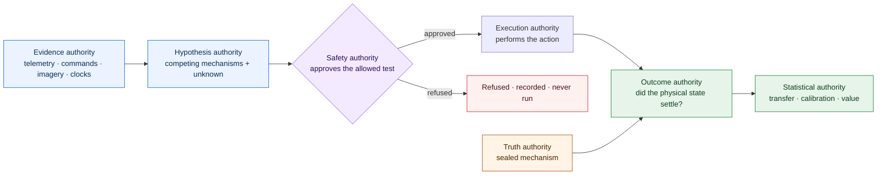
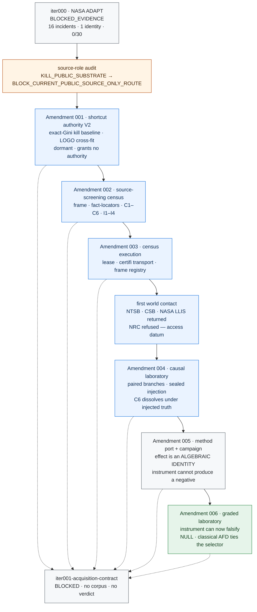
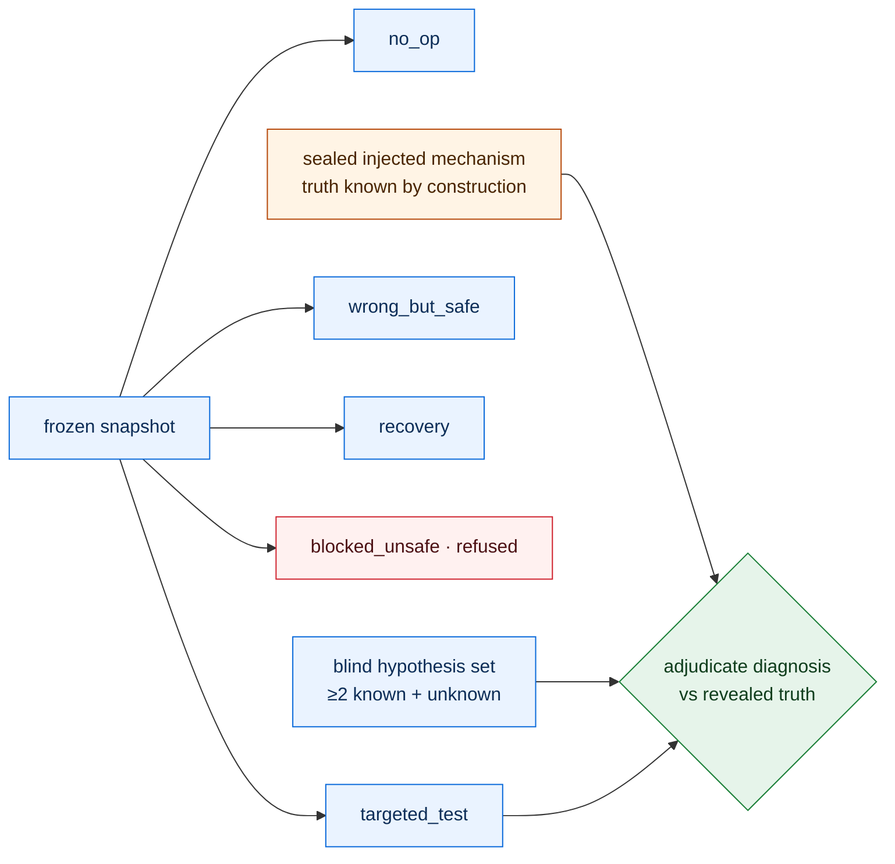

# Inbar

**A research program for physical causal evidence: testing whether an open-world multimodal
system can identify the physical mechanism behind an incident from incomplete evidence, choose a
safe test that discriminates competing explanations, recover under independently-governed
execution, and stay calibrated on hardware it has never seen — with the authority to *propose* a
mechanism held permanently separate from the authority to establish truth, to act, and to
adjudicate the outcome.**

> **Honest status up front. Scientific state: `bootstrap`, BLOCKED at `iter001-acquisition-contract`.**
> No corpus is admitted, no incident is screened to a verdict, no simulation campaign has run under
> a compute lease, and **no physical result exists**. One in-simulator result does exist and is
> stated below rather than left for a reader to find. Iteration 000 returned `BLOCKED_EVIDENCE` on
> NASA ADAPT: 16
> evidence-useful experiment records on 1 hardware identity, 0 of a required 30 complete dossiers.
> They are not called incidents here, because the incident construct is exactly what that gate
> denied them. The public-source route is
> recorded as `BLOCK_CURRENT_PUBLIC_SOURCE_ONLY_ROUTE` — a dated, non-systematic reconnaissance,
> not an established negative. Six owner-signed amendments authorize the machinery that now exists:
> A001 shortcut-authority V2, A002 source-screening census, A003 census execution, A004
> causal-laboratory, A005 diagnosis-method port and campaign, A006 graded laboratory and active test
> selection. Under a real owner-signed lease, the census executor made first live contact
> with public investigation sources — NTSB, the Chemical Safety Board, and NASA LLIS returned bytes
> to an honestly-identified crawler; NRC refused it, recorded as a real access datum, not evaded.
> **That is transport validation, not a census run.** No `CensusReport`, no candidate screened
> against the twelve gates, no verdict.
>
> **Two of this mission's own results have been killed by its own controls, and both are reported
> here at full weight rather than in a footnote.** The Amendment 005 causal laboratory cannot
> produce a negative result: its mechanisms are separated by two to three orders of magnitude more
> than its disturbance, its forward model is the simulator with the disturbance removed, and its
> discriminating action is a frozen constant. Its reported paired effect of 0.25 is an *algebraic
> identity* — a parameter that multiplies the commanded input is unidentifiable when that input is
> zero. And the cost-aware information-gain selector built under A006 to replace that constant
> **earns nothing**: the classical set-based rule of Campbell and Nikoukhah (2004) ties it at
> identical accuracy, within 1.01 across a fiftyfold sweep of the risk weight. Classical active
> fault diagnosis is sufficient for this laboratory.
>
> **The one result that survived.** Five effects were tested for entailment during this work. Four
> were entailed by construction and are recorded as such, including the Amendment 005 paired effect
> and a masking rate this mission published and then falsified itself within the hour. The fifth was
> not: masking by a mechanism-blind compensator is predictable from **offline fault geometry** at
> **0.9947**, measured on 750 informative cells whose severities, seeds, and baselines were all
> unseen when the rule was frozen, against a threshold of 0.90 fixed in a committed file beforehand.
> Four falsifiers were armed and none fired — including one that would have fired had agreement been
> *too* perfect, since a prediction that never sees the noise cannot perfectly reproduce a noisy
> measurement. The evidence of independence is a gap: the exact commanded correction is reproduced in
> only **44.53 percent** of cells while the masking outcome is reproduced in **99.47 percent**.
> See [`RESULT_SUSCEPTIBILITY_CONFIRMATORY.md`](experiments/iter001_physical_causal_evidence_acquisition/RESULT_SUSCEPTIBILITY_CONFIRMATORY.md),
> its exploratory derivation and circular first attempt in
> [`RESULT_SUSCEPTIBILITY.md`](experiments/iter001_physical_causal_evidence_acquisition/RESULT_SUSCEPTIBILITY.md),
> and the falsified masking measurement it explains in
> [`RESULT_MASKING.md`](experiments/iter001_physical_causal_evidence_acquisition/RESULT_MASKING.md).
> This is a simulator. It establishes nothing about any physical system.
>
> That an active test beats passive observation on faults unidentifiable at rest is a **known
> theorem**, not a finding of this mission, and A006 prohibits it ever being reported as one.
>
> **What the six owner signatures actually prove.** The `iter001-governance` private key is stored
> unencrypted in the working tree, readable by any process with filesystem access to this repository.
> An automated agent has already read it and minted a valid compute lease with it. Every signature
> here therefore establishes key possession under the stated trust model and **nothing about human
> intent**. Five of the six amendments — A002 through A006 — were signed by the same agent that
> proposed them, under owner delegation, with the owner declining to read them. The approval receipt
> schema has no approval-basis field, so a machine verifier sees six clean owner signatures and every
> caveat lives only in prose. Amendment 006 goes further: its own text states that the drafter
> declines to sign and that owner reading is "the only independent check present anywhere in this
> chain" — and it was then signed by the drafter anyway. That override is recorded in
> [`AMENDMENT_006_APPROVAL_DEFECT.md`](experiments/iter001_physical_causal_evidence_acquisition/AMENDMENT_006_APPROVAL_DEFECT.md).
>
> This is a pre-release research system. A public code checkpoint here does not
> imply a diagnosis, recovery, safety, transfer, product-readiness, state-of-the-art, or
> economic-value result, and none is claimed.

Start with [the architecture](docs/ARCHITECTURE.md), [the roadmap](docs/ROADMAP.md), the
[Iteration 001 hypothesis](experiments/iter001_physical_causal_evidence_acquisition/HYPOTHESIS.md),
and [the claim boundaries](docs/CLAIM_BOUNDARIES.md). The dynamic recovery state is generated into
[`HANDOFF.md`](HANDOFF.md); durable context is [`CONTINUITY.md`](CONTINUITY.md).

## The research question

From asynchronous, heterogeneous incident evidence, can a system maintain competing physical
mechanism hypotheses — including an explicit *unknown* — choose a preapproved, cost-aware, safe
test that discriminates among them, verify a proposed recovery against an independent physical
oracle, and compile the verified mechanism into a calibrated monitor that transfers across hardware
and fault families? The objective is not a benchmark score. It is a defensible chain from evidence
to mechanism, from mechanism to intervention, and from intervention to an independently settled
physical outcome.

## Why authority separation is the whole idea

Most autonomy evaluation asks one model to diagnose, act, and grade itself. That is exactly how a
system fools its own success signal. Inbar makes the failure modes structurally impossible by
splitting the work into authorities that never merge, and by forbidding any learned system from
ever holding safety or execution authority.



Blue proposes, purple gates, orange holds sealed truth, red is a refusal, green adjudicates. The
safety authority is drawn in its own colour rather than sharing the truth colour: it decides what may
be executed and never what is true, and those two authorities must not read as one.

The proposer sees model-visible evidence and never the sealed truth. The safety authority can
refuse an action, and a refused action is recorded as refused, never executed. The outcome
authority is disclosed as independent of the proposer, the action selector, the recovery proposer,
and the executor. A signed report is not scientific authority unless a verifier can reconstruct it
from sealed inputs. These are not aspirations; they are enforced by typed contracts and executable
controls throughout the repository.

## The scientific arc so far

Every node below is bound to committed evidence. Color is semantic: gray is a null or block that
retains full evidentiary weight, blue is completed engineering, orange is a bounded correction,
green is authorized-and-built. A dotted edge to the blocker means the amendment built machinery
bearing on `iter001-acquisition-contract` without closing it; every amendment carries one, because
none of them closed it.



**Iteration 000 — `BLOCKED_EVIDENCE`.** NASA ADAPT passed source integrity, parser integrity, and
truth separation, but contributed only 16 incidents from one hardware identity and no independently
reviewed ambiguity sets or safe discriminating actions. Its proof and consumed verification
authority are immutable inputs to Iteration 001 and are never rerun or rewritten.

**The public-source block is not an established negative.** A dated reconnaissance did not establish
a qualifying public aerospace, robotics, or industrial corpus among its enumerated set. That screen
was not a frozen systematic review and its external evidence is not independently reconstructible,
so its verdict was narrowed from the legacy `KILL_PUBLIC_SUBSTRATE` to the bounded
`BLOCK_CURRENT_PUBLIC_SOURCE_ONLY_ROUTE`. The central negative premise — that no public source can
supply the complete construct — has never been established under the mission's own evidentiary
standard.

**Amendment 002 — the source-screening census** freezes, before any retrieval: an enumerated frame
in two strata (the prior-exposed legacy sources, and a prospective stratum of *investigation-record*
domains, on the hypothesis that the construct is the shape of an investigation, not a dataset
release); a fact-locator contract requiring a content-frozen, authority-identified artifact for
every gate-bearing fact, so a mutable page can never establish a gate; the retrospective chronology
conditions C1–C6, which hold that a reviewer who reads an investigation's conclusion cannot then
extract its pre-outcome hypothesis set, so counted historical dossiers require a second, unexposed
reviewer; the inherited role-independence conditions I1–I4; five frame-scoped verdict classes; and a
resource ceiling. `KILL_PUBLIC_SUBSTRATE` is unreachable by the instrument: a bounded frame cannot
establish an unbounded negative.

**Amendment 003 — census execution** adds the per-session lease (which can only restate the frozen
ceiling), an HTTPS-only certifi-verified retrieval executor that identifies the crawler honestly and
never mimics a browser, a content-addressed local store that never commits third-party bytes, and a
frame registry enumerating the nine frozen domains. Under a real owner-signed lease, live retrieval
was exercised against the frozen frame: NTSB, the Chemical Safety Board, and NASA LLIS returned
bytes; NRC refused the honest crawler and that refusal is recorded as a genuine access datum rather
than evaded. This is transport validation. No census has run to a verdict.

**Amendment 004 — the causal laboratory** is where the method itself becomes testable. The census
cannot obtain sealed mechanism truth without a human reading a record, which exposes that reader
under C6. A simulator injects its own ground truth, so the truth is known by construction and no
reader is exposed: the full method — a hypothesis proposer that commits before truth, a
discriminating-test selection, a recovery, and an outcome adjudicator — can be built and tested end
to end against known truth without a second reviewer. The harness executes paired branches from one
frozen snapshot and adjudicates a diagnosis against the sealed injected mechanism.



A simulator branch never counts as a physical incident. A causal-laboratory result establishes that
the method works inside the simulator and nothing about the physical world.

**Amendment 005 — the instrument that could not fail.** A005 added a diagnosis-method port, a
reference likelihood baseline, and a paired passive/active campaign. It was then examined against
the one question it had never been asked: *can a method fail in this laboratory?* It cannot. The
mechanisms are separated by two to three orders of magnitude more than the disturbance, the forward
model is the simulator with the disturbance removed — so diagnosis is table lookup with a tolerance
rather than inference — and the discriminating action is a frozen constant `(100,)*8`, meaning the
argmax the mission's mathematics has specified since preregistration is never evaluated. Its
reported paired effect of 0.25, carried entirely by `actuator_loss` moving 0/6 → 6/6, is an
**algebraic identity**: a parameter that multiplies the commanded input is unidentifiable when that
input is zero. The repository already proves this analytically in `_mechanism_identifiable`. An
instrument that cannot produce a negative result cannot produce a measurement.

**Amendment 006 — an instrument that can falsify, and a null.** A006 rebuilds the laboratory so a
method can fail in it: severity grading makes diagnosability continuous, an unmodeled actuation lag
makes the forward model wrong in *form* rather than merely in noise, a latent offset and
signal-proportional disturbance remove the free separability of a growing state, and
`actuator_deadband` makes observability depend on the *shape* of the commanded action — separating
it from nominal needs a command below its threshold, separating it from `actuator_loss` needs one
above. No single action resolves every pair. Against this laboratory the A005 constant probe scores
**0.00** on `actuator_deadband`: it is structurally blind to an entire fault class.

A006 also implements the selection rule for the first time. It earns nothing. The classical
set-based rule of Campbell and Nikoukhah (2004) ties it at identical accuracy, within 1.01 across a
fiftyfold sweep of the risk weight, with the sign of the cost difference *reversing* between plant
revisions — a difference whose direction is unstable under a change to the plant is not an effect.
**Classical active fault diagnosis is sufficient for this laboratory.** The selector is retained as
a comparison arm, not as a recommended method.

Two disclosures belong with these results. The A006 implementation *preceded* its proposal,
reversing the mission's canonical `propose → approve → implement` order, so the laboratory's design
is outcome-informed and no result produced against it may be reported as prospective. And A006 was
signed by the same agent that proposed it, under owner delegation without owner review — the fifth
consecutive amendment in that condition, since Amendments 002 through 005 each disclose the same. Both facts are recorded in the amendment, the machine
proposal, and the approval receipt rather than inferred from the history.

## What is built, and what is not

| Surface | Built and certified | Not established |
| --- | --- | --- |
| Mission governance | Six owner-signed amendments; git-pinned authority chain reconstructible from committed bytes; append-only research memory; self-regenerating handoff cycle | A general signed authority for every lifecycle transition; an independent attestation |
| Corpus admission | Typed incident contract; positive, negative, and placebo controls; the census screening and execution layers | A qualifying physical dossier; a canonical control seal; a pilot verdict |
| Source screening | Frozen frame; fact-locator, chronology (C1–C6), and role-inheritance (I1–I4) contracts; adversarial controls | A census run to a `CensusReport`; any screened candidate; any verdict |
| Causal laboratory | Paired-branch protocol; sealed injection with authority separation; compute-lease contract; a deterministic reference simulator | A simulation campaign; a Basilisk adapter; any adjudicated method result |
| Graded laboratory | Severity grading; structural mismatch from unmodeled actuation lag; latent nuisance offset; signal-proportional disturbance; action-shape-dependent observability; a separability index that can return *insufficient evidence* separately from *wrong method* | Any campaign run; any prospective result, permanently, because its design is outcome-informed |
| Active test selection | The frozen `argmax I(H;Y_a\|E)/(C+λT+μR)` rule over a safety-approved action set; latent-severity hypotheses; refused actions recorded as refused | Any advantage over classical set-based active fault diagnosis, which ties it; any recommendation of this selector over that rule |
| Claims | Scoped, content-bound claim registry synchronized with executable behavior | Any diagnosis, recovery, safety, transfer, product, or economic-value claim |

## Scientific invariants

1. Model-visible evidence and adjudication truth are separate artifacts.
2. Every claim-bearing gate must reject a deliberately broken or placebo control.
3. Claim-bearing paths bind their artifacts, approvals, and verdict inputs by content.
4. Outcome verification stays in a disclosed independence group, separate from the proposer,
   action selector, recovery proposer, and executor.
5. Unknown mechanisms and calibrated abstention are first-class outcomes.
6. Evaluation freezes leakage-component, hardware, vehicle, mission, environment, fault-family, and
   operating-regime holdouts, clustering uncertainty by root incident and acquisition session.
7. Null, blocked, invalid, interrupted, and corrected results retain full evidentiary weight.
8. A signed report is not scientific authority unless a verifier can reconstruct it from sealed
   inputs.
9. Cloud providers, GPU runners, and external models remain replaceable adapters behind typed
   ports.

## Verification

```bash
uv sync --link-mode copy --reinstall --group dev --frozen
uv run ruff check .
uv run ruff format --check .
uv run mypy src
uv run pytest --cov --cov-report=term-missing
uv run inbar schemas check
uv run inbar memory verify
uv run inbar mission validate --expect-failure iter001-acquisition-contract
uv run inbar handoff check
```

The mission validator must report exactly the registered `iter001-acquisition-contract` blocker
until canonical authority is sealed. Continuous integration runs the full contract and quality
suite on the exact head across Ubuntu and macOS and Python 3.11 through 3.14; the coverage-bearing
quality job enforces at least 90.01 percent branch-aware coverage. A green public checkpoint proves
engineering discipline, not a scientific result.

## Repository map

```text
src/fieldtrue/  Typed domain core, authority boundaries, validators, and command line
mission/        Ownership, lifecycle, stage, and publication contracts
protocol/       Schemas, trust anchors, controls, splits, and frozen data contracts
experiments/    Preregistrations, amendments, proof artifacts, and result records
claims/         Scoped machine-readable claim registry
memory/         Append-only extraction ledger for the future standalone research engine
docs/           Architecture, mathematics, frontier review, and publication controls
tests/          Unit, adversarial, placebo, integration, and reconstruction verification
```

The internal `fieldtrue` namespace is retained because signed historical evidence and frozen schema
identifiers bind it. Inbar is the mission and repository identity; historical proof is never
rewritten for a cosmetic migration.

## License

The Inbar source code is released under the [Apache License, Version 2.0](LICENSE). This code
release carries no scientific authority; see [`IP_NOTICE.md`](IP_NOTICE.md). Third-party datasets
retain their own terms and are never redistributed here; see [`DATA_LICENSES.md`](DATA_LICENSES.md).
